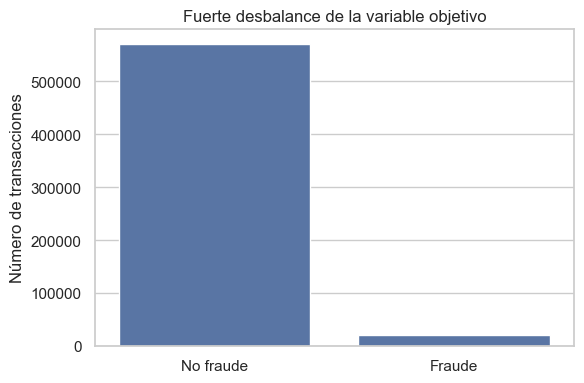
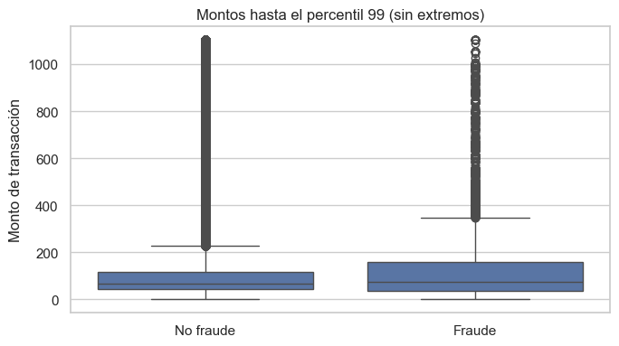
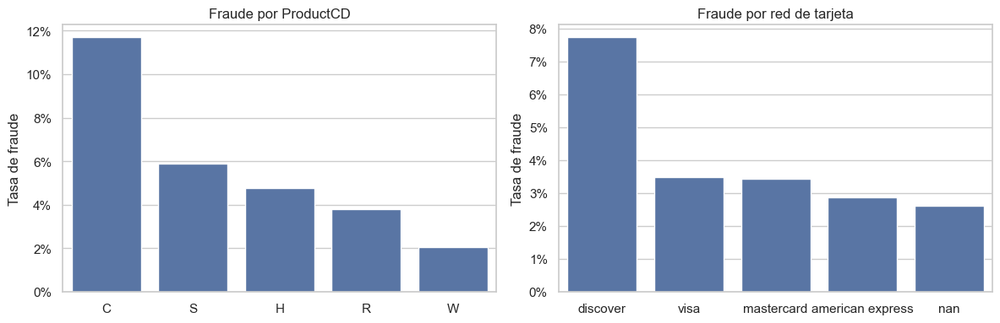
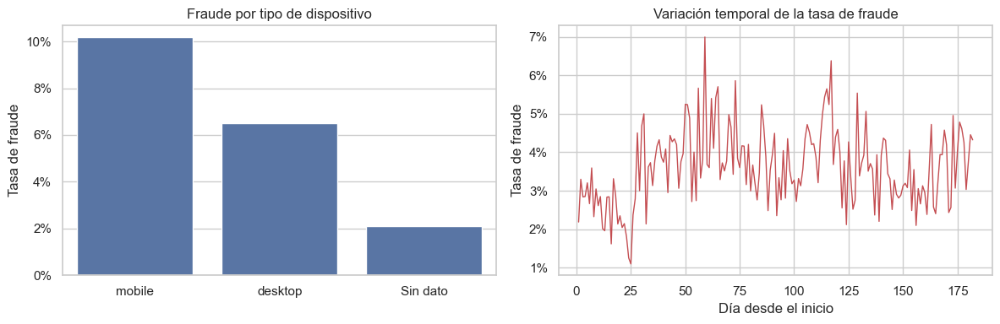

# IEEE-CIS Fraud Detection — EDA

En 590,540 transacciones, el 3.50% es fraude; `ProductCD`, dispositivo y tiempo muestran señales útiles para un modelo posterior.

## Desbalance de fraude

Solo el 3.50% de las transacciones es fraude, por lo que el conjunto está fuertemente desbalanceado. Un modelo no debe evaluarse únicamente con exactitud, pues podría predecir siempre “no fraude” y aun así parecer preciso.

## Montos de transacción

Las transacciones fraudulentas presentan una mediana y una distribución de montos ligeramente mayores. El gráfico elimina el 1% de valores más extremos para que la comparación del comportamiento habitual sea legible.

## Producto y red de tarjeta

El producto `C` registra la mayor tasa de fraude (~11.7%), frente a ~2.0% de `W`; además, `discover` destaca entre las redes de tarjeta (~7.7%). Estas diferencias sugieren que ambas variables pueden aportar señal predictiva.

## Dispositivo y tiempo

Las operaciones desde móvil muestran más fraude (~10.2%) que las de escritorio (~6.5%), aunque muchos registros no incluyen dispositivo. La tasa también varía durante los días, por lo que conviene preservar el orden temporal al evaluar modelos.

